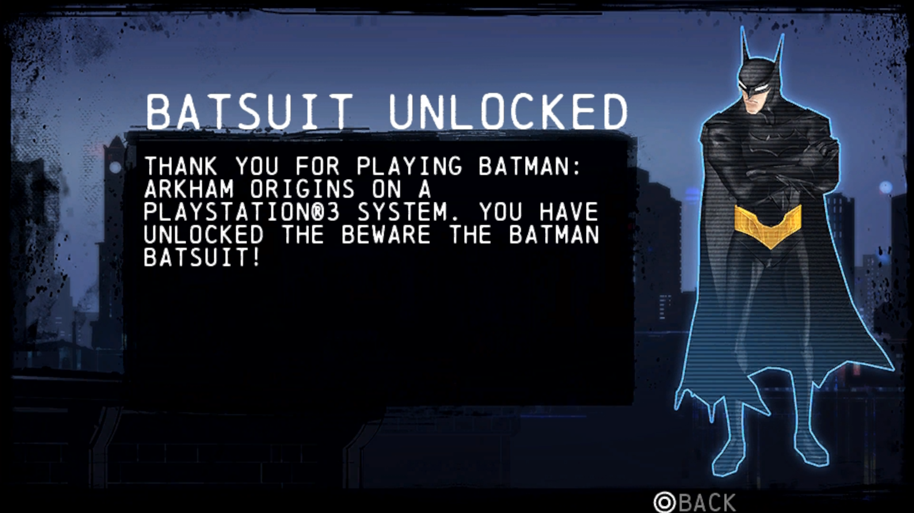

# Batman: Arkham Origins Blackgate - Vita save game (US Copy)

This repository contains a save game file for *Batman: Arkham Origins Blackgate* on the PlayStation Vita. The save includes the **"Beware the Batman" Batsuit** already unlocked.

## Screenshot

## About the Save

This save file is for the PlayStation Vita version of *Batman: Arkham Origins Blackgate*. The "Beware the Batman" Batsuit, a unique cosmetic item, is pre-unlocked in this save.

### How the Batsuit is Unlocked

The "Beware the Batman" Batsuit can only be unlocked by linking your PlayStation Vita to a PlayStation 3 console. Both systems must be connected to the PlayStation Network (PSN), and the PlayStation 3 must be running a copy of *Batman: Arkham Origins* (non-Blackgate version). This save file bypasses that requirement, providing immediate access to the Batsuit.

## Usage

1. Download the save file from this repository.
2. Transfer the save file to your PlayStation Vita using a Apollo save manager
3. Load the save in *Batman: Arkham Origins Blackgate* to access the game with the "Beware the Batman" Batsuit unlocked.

## Notes

- Ensure you back up your existing save files before overwriting them.
- This save is specific to the PlayStation Vita version of the game.
- The save file is about 25 minutes into the save file. After the intro sequence, and after causing the elevator to fall. There is 8 cages collected